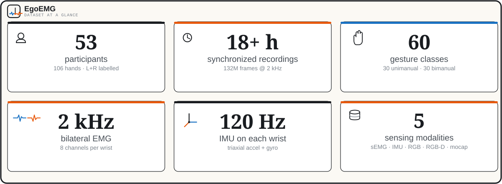
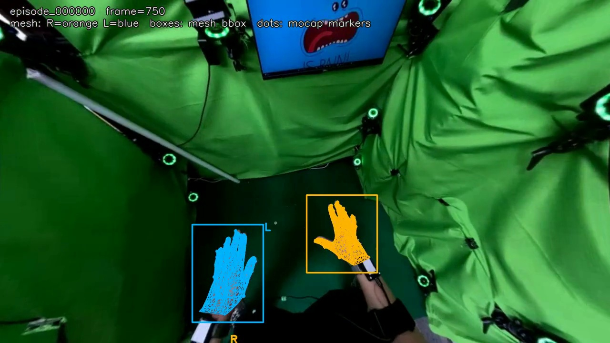

<p align="center">
  
</p>

<h1 align="center">EgoEMG</h1>

<p align="center">
  <b>A multimodal egocentric dataset with bilateral surface EMG and webcam vision
  for hand pose estimation</b><br>
  EMG-to-pose · vision-to-pose · EMG+vision fusion
</p>

<p align="center">
  <a href="#-release-status"></a>
  <a href="#-license"></a>
  <a href="https://github.com/zhenqis123/EgoEMG/actions"></a>
  
  
</p>

<p align="center">
  [ <a href="#-release-status">Release status</a> ·
    <a href="#-setup">Setup</a> ·
    <a href="#-training">Training</a> ·
    <a href="#-visualization">Visualization</a> ·
    <a href="#-results-and-evaluation">Results</a> ·
    <a href="#-license">License</a> ·
    <a href="#-citing-egoemg">Citation</a> ]
</p>

---

> [!NOTE]
> **Code pre-release (`0.1.0rc1`).** The complete EgoEMG dataset release is
> still in preparation. Until then, the earlier legacy data/checkpoint
> package is available and verified for every workflow documented in this
> README — all quoted results are measured from it and command-reproducible.
> It is not the forthcoming dataset release and does not cover every
> historical research configuration.

## ✨ Highlights

- **🧠 EMG-to-pose** — EMGFormer (small / middle / large) predicts hand pose
  from bilateral surface EMG; **13.9° Avg MAE** with the released
  EMGFormer-M checkpoint, command-reproducible end to end.
- **👁️ Vision-to-pose** — ResNet / ViT single-frame predictors on the
  egocentric webcam stream (**5.84°** with the released ResNet-18).
- **🔀 EMG+vision fusion** — combines EMG and visual cues on identical center
  frames for the best of both (**5.36°** with the released ResNet-50 fusion).
- **🎥 One-command visualization** — overlay videos with projected meshes and
  mocap markers, straight from the released memmap and videos.

## 🚧 Release Status

The canonical workflows in this README — EMGFormer training, ResNet-18
vision/fusion, evaluation, and visualization — run on the earlier legacy
data/checkpoint release, not the forthcoming dataset release.

Follow [Legacy Asset Setup](docs/ASSET_SETUP.md) before running these workflows.
It distinguishes the single-episode preview from the complete legacy asset tree,
lists the expected directory layout, and documents external MANO requirements.
See also [the code pre-release support boundary](docs/PRERELEASE_LIMITATIONS.md)
and the [data-card placeholder](docs/DATA_CARD.md).

<details>
<summary><b>Legacy material</b></summary>

Some legacy artifacts may remain in repository history or third-party storage.
They are not part of this release contract: availability, integrity, license
scope, compatibility, and result reproducibility are not guaranteed. Do not
redistribute or cite them as the forthcoming EgoEMG dataset.
</details>

<details>
<summary><b>Dataset IMU note (updated 2026-08-20)</b></summary>

The unified memmap's `imu` field carries real wrist-band inertial data for all
three sources in a single `[acc_x, acc_y, acc_z, gyro_x, gyro_y, gyro_z]`
layout (m/s², gravity ≈ 9.2–9.7 at rest; the EgoEMG band's gyro_x axis is
dead and stored as 0). Legacy-release copies downloaded **before 2026-08-20**
store the EgoEMG rows with the two halves swapped; run
`scripts/prepare/fix_egoemg_imu_channel_order.py --memmap-dir <dir> --apply`
to repair them in place, or re-download `imu.dat` / `manifest.json` — see
[Legacy Asset Setup](docs/ASSET_SETUP.md#7-imu-channel-order-fix-2026-08-20)
for checksums and details.
</details>

## ⚙️ Setup

```shell
conda env create -f environment.yml && conda activate emg2pose
pip install -e '.[viz]'
```

For core code only, use `pip install -e .`; the `viz` extra installs public
visualization dependencies. `environment.yml` selects the tested CUDA-enabled
PyTorch build. Download and configure legacy data/checkpoints with
[Legacy Asset Setup](docs/ASSET_SETUP.md).

## 🚀 Training

Supervised EMG, vision, and fusion training use `egoemg.train`; the Hydra
experiment selects the model family. These are maintainer workflow sketches —
they require the unreleased legacy assets from
[Legacy Asset Setup](docs/ASSET_SETUP.md). Before inspecting a different
experiment config, run `python scripts/release/audit_portability.py` to see
whether it has research-only local/private references.

> **Hardware:** the reference recipes use NVIDIA GPUs with CUDA 11.8. The EMG
> example below is a six-GPU run and the fusion example uses five GPUs. For a
> one-GPU smoke run, set `trainer.devices=[0]` and reduce `batch_size` (and
> `val_batch_size` when applicable) to fit your GPU memory.

```shell
# EMG-to-pose (EMGFormer-M regression recipe on EgoEMG)
python -m egoemg.train \
  experiment=emgformer/regression_egoemg \
  'trainer.devices=[0,1,2,3,4,5]' '+trainer.strategy=ddp' \
  batch_size=500

# Vision-only single-frame baseline (ResNet-18)
python -m egoemg.train \
  experiment=fusion/vision_resnet18 \
  train=true eval=true 'trainer.devices=[0]'

# EMG+vision fusion (ResNet-18 + EMGFormer-S, center-supervised)
python -m egoemg.train \
  experiment=fusion/fusion_rn18_s_center_16ch_wl7790 \
  train=true eval=true 'trainer.devices=[0,1,2,3,4]'

# EMGFormer multi-task pretraining
python -m egoemg.train_pretrain \
  experiment=emgformer/pretrain_multitask \
  train=true eval=false 'trainer.devices=[0]'
```

Active experiments live in `config/experiment/emgformer/` and
`config/experiment/fusion/`; shell launchers for the paper experiments live in
`experiments/`. For evaluation, use `egoemg.test_analysis` (see
[Evaluation](#evaluation)): fusion configs default to `train=true`, so the
training entrypoint would otherwise start a new run.

## 🎥 Visualization

One entrypoint, four modes — all headless:

| Mode | What you get |
|------|--------------|
| `vision` | head-view overlay MP4 (hand meshes, projected mocap markers, per-hand boxes) plus one precomputed-crop MP4 per hand |
| `timeline` | EMG signal timeline PNG for an episode |
| `mesh` | world-space MANO/FK meshes as GLB, with marker and occlusion renders |
| `fk_vs_mano` | side-by-side forward-kinematics vs MANO comparison |

```shell
python scripts/viz/visualize_dataset.py vision \
  --memmap-dir ${EMG2POSE_ROOT}/data/EgoEMG_unified_memmap \
  --allintra-root ${EMG2POSE_ROOT}/data/EgoEMG_allintra \
  --crops-dir ${EMG2POSE_ROOT}/data/EgoEMG_v2_crops \
  --data-root ${EMG2POSE_ROOT}/data \
  --output-dir /tmp/egoemg_vision_viz \
  --episode-id episode_000000 --stride 10 --max-frames 300
```

<p align="center">
  
</p>

For the required precomputed-crop behavior and unsupported external assets, see
[the code pre-release support boundary](docs/PRERELEASE_LIMITATIONS.md). For a
larger visual check or WiLoR-specific setup notes, see
[the EgoEMG/WiLoR training guide](docs/egoemg_wilor_training.md).

## 📊 Results and evaluation

EMGFormer rows are measured with the released checkpoints via the commands
below (2026-08-20, single RTX 4090, fresh clone + the
[legacy assets](docs/ASSET_SETUP.md)); prior-work rows are paper-reported,
as their checkpoints are not part of the bundle. All tables report MAE in
degrees.

**EMG-to-pose on EgoEMG** (per-user mean ± std across the Gesture / User /
Both test splits; Avg. is the per-sample-weighted MAE across the three
splits):

| Method | Params | Gesture | User | Both | Avg. |
|--------|--------|---------|------|------|------|
| EMGFormer-S | 3.5M | 12.4 ± 1.5 | 16.0 ± 0.6 | 16.4 ± 1.5 | **14.2** |
| EMGFormer-M | 6.6M | 11.9 ± 1.6 | 16.0 ± 0.7 | 16.3 ± 1.5 | **13.9** |
| EMGFormer-L | 16.3M | 12.0 ± 1.6 | 16.1 ± 0.9 | 16.4 ± 1.3 | **14.0** |
| vEMG2Pose | 6.0M | 15.0 ± 1.4 | 16.3 ± 1.7 | 17.3 ± 1.3 | 15.9 |
| NeuroPose | 6.4M | 15.8 ± 1.2 | 15.7 ± 1.3 | 16.3 ± 0.7 | 16.1 |

For reference, the paper reports S 12.8/15.6/17.4/14.7,
M 11.8/15.6/17.4/14.2, and L 11.7/15.7/17.7/14.2 (Gesture/User/Both/Avg);
the measured Avg improves on all three. Those values come from an earlier
16-channel, WL=7790 evaluation generation that predates the released
checkpoints (provenance traced in
[docs/code_review_findings_20260820.md](docs/code_review_findings_20260820.md)).

**EMG-to-pose on the EMG2Pose benchmark** (per-user mean ± std across the
User / Stage / User+Stage test splits):

| Method | Params | User | Stage | User+Stage |
|--------|--------|------|-------|------------|
| EMGFormer-S | 3.5M | 12.5 ± 1.1 | 11.1 ± 1.2 | 12.3 ± 1.1 |
| EMGFormer-M | 6.6M | 12.4 ± 1.1 | 10.2 ± 1.1 | 12.4 ± 1.1 |
| EMGFormer-L | 16.3M | 12.3 ± 1.1 | 9.3 ± 1.1 | 12.3 ± 1.1 |

*The legacy checkpoint bundle contains the EMGFormer-S/M/L checkpoints for these
rows; prior-work rows remain paper-reported only.*

**Vision-only → EMG+vision fusion on EgoEMG** (identical center frames;
Frz./FT = frozen/fine-tuned visual predictor; Avg. is the per-sample-weighted
MAE, Δavg the fusion gain):

| Backbone | Update | Vision Avg | Fusion Avg | Δavg |
|----------|--------|-----------|-----------|------|
| ResNet-18 | FT | 5.84 | 5.40 | +0.44 |
| ViT-S/14 | FT | 6.02 | 5.54 | +0.48 |
| ResNet-50 | Frz. | 5.27 | 5.19 | +0.09 |
| ResNet-152 | Frz. | 5.11 | 5.06 | +0.05 |
| ViT-B/14 | Frz. | 5.78 | 5.75 | +0.03 |
| ViT-L/14 | Frz. | 5.39 | 5.36 | +0.03 |
| WiLoR | Frz. | 4.73 | 4.68 | +0.04 |

*The legacy checkpoint bundle covers the fine-tuned ResNet-18 / ViT-S
vision-only rows, the fine-tuned ResNet-50 / ViT-S fusion rows, and the
EMGFormer rows. The fine-tuned ResNet-18 fusion row and all frozen-backbone
rows remain paper-reported only.*

### Evaluation

After completing [Legacy Asset Setup](docs/ASSET_SETUP.md), use these commands
with the matching legacy data and checkpoint assets.
The EgoEMG experiment configs enable `per_group_stats` by default, so the
output reports the per-user / per-gesture mean ± std (matching the paper
tables) plus an `overall` MAE: the same per-sample-weighted aggregate reported
in the paper's Avg column:

```shell
export EMG2POSE_ROOT=/absolute/path/to/dataset_root

# EgoEMG EMGFormer (8ch target_hand layout); reports per-group stats + overall
python -m egoemg.test_analysis \
  experiment=emgformer/egoemg_emgformer_small \
  'checkpoint=checkpoints/egoemg_emgformer_small.ckpt'

# EMG2Pose benchmark EMGFormer (16ch)
python -m egoemg.test_analysis \
  experiment=emgformer/emg2pose_emgformer_small \
  'checkpoint=checkpoints/emg2pose_emgformer_small.ckpt' \
  data_location=${EMG2POSE_ROOT}/data/emg_corpus/emg2pose_v3_memmap
```

**Vision and fusion** checkpoints use the same `test_analysis` entrypoint;
their experiment configs enable `center_frame_eval`, which evaluates on
identical center frames and reports the per-hand MAE. The config must match
the checkpoint's training setup (EMG channels, window length) — the commands
below pin the matching recipe for each released checkpoint:

```shell
# Vision-only ResNet18
python -m egoemg.test_analysis \
  experiment=fusion/vision_resnet18 \
  'checkpoint=checkpoints/vision_resnet18.ckpt'

# Vision-only DINOv2 ViT-S/14
python -m egoemg.test_analysis \
  experiment=fusion/vision_vit_small \
  'checkpoint=checkpoints/vision_vit_small.ckpt'

# EMG+vision fusion (ResNet-50 + 8ch EMG featurizer, WL 12000)
python -m egoemg.test_analysis \
  experiment=fusion/fusion_rn50_m_center_eval_released \
  'checkpoint=checkpoints/fusion_resnet_emgfusion_center.ckpt'

# EMG+vision fusion (DINOv2 ViT-S/14 + 16ch EMG featurizer, WL 7790)
python -m egoemg.test_analysis \
  experiment=fusion/fusion_vits_s_center_eval_released \
  'checkpoint=checkpoints/fusion_vit_emgfusion_center.ckpt'
```

The released fusion checkpoints are the fine-tuned ResNet-50 and ViT-S fusion
models; the `*_center_eval_released` recipes pin the matching architectures
and null the training-time branch-initialization paths so only the released
assets are needed.

<details>
<summary><b>Evaluation notes</b></summary>

- Checkpoint filenames containing `=` (e.g. `epoch=011-val_mae=0.1022.ckpt`)
  cannot be passed through Hydra CLI overrides; symlink to a `=`-free path or
  set the `checkpoint:` field in a user config.
- Fusion and vision evals use the same 2096/2082 center frames per hand.
  If a fusion eval reports fewer samples, its evaluation window is longer
  than the reference WL=7790 grid and frames near episode edges are dropped
  (the model window must fit inside the episode). Expected, not a bug.
- `results.csv` is written into the Hydra run directory (`logs/<date>/...`),
  never into the repo root.
- MAE is computed on joint-angle targets stored in **radians**; the tables
  above are converted to degrees (`0.0944 rad ≈ 5.41°`). The evaluation
  recipes already pin the per-dataset statistics keys that match each
  released checkpoint's training; only custom configs evaluating
  unified-trained checkpoints need `+eval_dataset_name=egoemg_unified`.

`test_analysis` is the single evaluation tool for all three modalities
(EMG generalization splits with per-group stats, and vision/fusion
center-frame evaluation), selected automatically by the experiment config.
</details>

## 🗂️ Repository Layout

```text
egoemg/        models, dataset loaders, training/eval entrypoints,
               vendored UmeTrack FK utilities
config/        Hydra experiment tree
  ├─ experiment/{emgformer,fusion}/   active experiment recipes
  └─ lineage/                         shared per-lineage defaults
scripts/       data conversion, downloads, visualization, paper figures
experiments/   shell launchers for the paper's experiments
docs/          config architecture, asset setup, dataset notes
assets/        EMG layout figures and normalization statistics
```

## 📜 License

Project-authored code is distributed under the **MIT License**. This repository
also contains third-party material with different terms, including UmeTrack
(CC-BY-NC-4.0); the current **EgoEMG dataset is not released**. See
[THIRD_PARTY_NOTICES.md](THIRD_PARTY_NOTICES.md) and the license files in the
corresponding directories before use or redistribution.

## 📖 Citing EgoEMG

The paper is currently under review. Until a public paper version is available,
please cite this repository and the exact commit used for your work.
