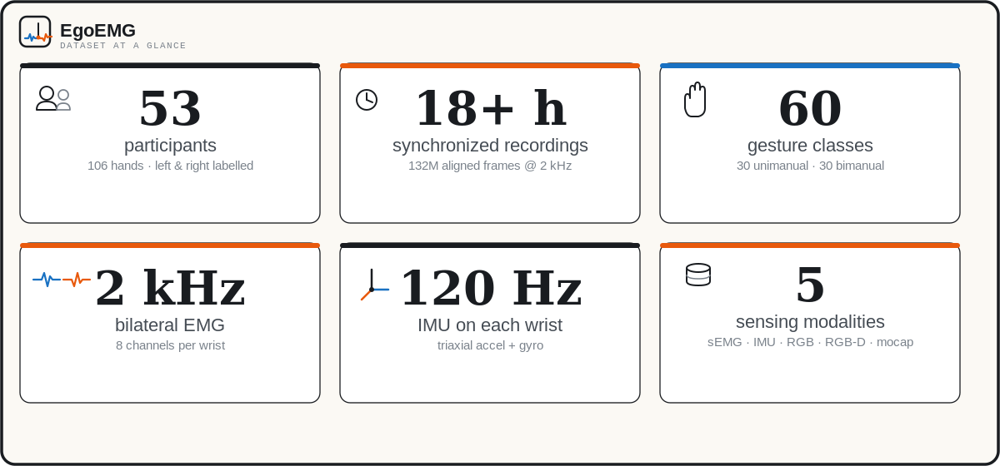

<p align="center">
  
</p>

<h1 align="center">EgoEMG</h1>

<p align="center">
  <b>A multimodal egocentric dataset with bilateral surface EMG and webcam vision
  for hand pose estimation</b><br>
  EMG-to-pose · vision-to-pose · EMG+vision fusion baselines
</p>

<p align="center">
  <a href="#dataset"></a>
  <a href="#license"></a>
  <a href="#pre-trained-checkpoints"></a>
  <a href="https://github.com/zhenqis123/EMG2PP/actions"></a>
  
  
</p>

<p align="center">
  [ <a href="#-reproducing-paper-results">Paper</a> ·
    <a href="#-dataset">Dataset</a> ·
    <a href="#-pre-trained-checkpoints">Checkpoints</a> ·
    <a href="#-citing-egoemg">BibTeX</a> ]
</p>

---

## ✨ Highlights

- **🧠 EMG-to-pose** — EMGFormer (small / middle / large) predicts hand pose from
  bilateral surface EMG.
- **👁️ Vision-to-pose** — ResNet / ViT single-frame predictors on the egocentric
  webcam stream.
- **🔀 EMG+vision fusion** — combines EMG and visual cues on identical center
  frames, with consistent gains over each modality alone.

## 📖 Contents

- [Dataset](#-dataset)
- [Pre-trained Checkpoints](#-pre-trained-checkpoints)
- [Setup](#-setup)
- [Training](#-training)
- [Visualization](#-visualization)
- [Reproducing Paper Results](#-reproducing-paper-results)
- [Repository Layout](#-repository-layout)
- [FAQ](#-faq)
- [License](#-license)
- [Citing EgoEMG](#-citing-egoemg)

## 📦 Dataset

The EgoEMG dataset package (memmap data, all-intra webcam videos, pre-cropped
patches, metadata/calibration, and a visualization tool) is released under
**CC-BY-NC-4.0** for research use and mirrored on Google Drive and Baidu Netdisk:

```shell
# Google Drive (default)
bash scripts/download/download_egoemg_data.sh

# or from Baidu Netdisk (requires `baidupcs` login)
bash scripts/download/download_egoemg_data.sh --source baidupcs
```

The `EgoEMG-dataset-small` package is a self-contained single-episode preview
(memmap + webcam video + pre-crop LMDB + metadata) — ideal for a first look.
The complete unified memmap (EgoEMG + ShowEE + Incre), the all-intra videos,
and the pre-crop patches are distributed separately under `EgoEMG_release/`
on Baidu Netdisk / the corresponding Google Drive folders.

## 🏆 Pre-trained Checkpoints

Ten pretrained checkpoints are provided and mirrored on Google Drive and Baidu
Netdisk:

| Checkpoint | Task |
|-----------|------|
| `egoemg_emgformer_small.ckpt` | EMG-to-pose on EgoEMG (EMGFormer-S) |
| `egoemg_emgformer_middle.ckpt` | EMG-to-pose on EgoEMG (EMGFormer-M) |
| `egoemg_emgformer_large.ckpt` | EMG-to-pose on EgoEMG (EMGFormer-L) |
| `emg2pose_emgformer_small.ckpt` | EMG-to-pose on EMG2Pose (EMGFormer-S) |
| `emg2pose_emgformer_middle.ckpt` | EMG-to-pose on EMG2Pose (EMGFormer-M) |
| `emg2pose_emgformer_large.ckpt` | EMG-to-pose on EMG2Pose (EMGFormer-L) |
| `vision_resnet18.ckpt` | Vision-to-pose (ResNet-18) |
| `vision_vit_small.ckpt` | Vision-to-pose (ViT-S) |
| `fusion_resnet_emgfusion_center.ckpt` | EMG+Vision fusion (ResNet-18) |
| `fusion_vit_emgfusion_center.ckpt` | EMG+Vision fusion (ViT-S) |

```shell
# Google Drive (default)
bash scripts/download/download_checkpoints.sh

# or from Baidu Netdisk (requires `baidupcs` login)
bash scripts/download/download_checkpoints.sh baidupcs
```

## ⚙️ Setup

```shell
conda env create -f environment.yml && conda activate emg2pose
pip install -e .
pip install -e egoemg/UmeTrack
```

Configs resolve data paths through `${oc.env:EMG2POSE_ROOT,.}`, so point it at
your dataset location — use an **absolute** path (Hydra changes the working
directory at runtime, so a relative root silently breaks path resolution):

```shell
export EMG2POSE_ROOT=/path/to/data_root
```

## 🚀 Training

All training shares one entrypoint (`egoemg.train`); the experiment config
selects the model family:

```shell
# EMG-to-pose (EMGFormer-S regression on EgoEMG)
python -m egoemg.train \
  experiment=emgformer/regression_egoemg \
  'trainer.devices=[0,1,2,3,4,5]' '+trainer.strategy=ddp' \
  batch_size=500

# Vision-only single-frame baseline (ResNet-18)
python -m egoemg.train \
  experiment=fusion/vision_resnet18 \
  train=true eval=true 'trainer.devices=[0]'

# EMG+vision fusion (ResNet-18 + EMGFormer-S, center-supervised)
python -m egoemg.train \
  experiment=fusion/fusion_rn18_s_center_16ch_wl7790 \
  train=true eval=true 'trainer.devices=[0,1,2,3,4]'
```

Experiment configs live in `config/experiment/{emgformer,fusion}/`; shell
launchers for the paper's experiments live in `experiments/`. For *evaluation*
use `egoemg.test_analysis` (see [Reproducing Paper Results](#-reproducing-paper-results))
— the fusion configs default `train=true`, so `egoemg.train` would start a new
training run instead of evaluating.

## 🎥 Visualization

The dataset-centric visualization renders dataset-aligned frames for selected
samples (headless; writes PNG/MP4). It does not require the per-episode camera
calibration assets (it falls back to identity intrinsics when they are absent):

```shell
python scripts/viz/visualize_egoemg_vision_dataset.py \
  --memmap-dir ${EMG2POSE_ROOT}/data/EgoEMG_unified_memmap \
  --video-root ${EMG2POSE_ROOT}/data/EgoEMG_allintra \
  --output-dir /tmp/egoemg_vision_viz \
  --num-samples 8 --target-hand both \
  --auto-build-index   # builds <memmap-dir>/vision_index if missing
```

## 📊 Reproducing Paper Results

Key numbers from the paper. Rows backed by a released checkpoint (see
[Pre-trained Checkpoints](#-pre-trained-checkpoints)) are reproducible with the
commands below; the remaining rows are reported from the paper only.

**EMG-to-pose on EgoEMG** (MAE in degrees, per-user mean ± std across the
Gesture / User / Both test splits; Avg. is the mean MAE):

| Method | Params | Gesture | User | Both | Avg. |
|--------|--------|---------|------|------|------|
| EMGFormer-S | 3.5M | 12.3 ± 1.5 | 16.0 ± 0.6 | 16.3 ± 1.5 | 14.1 |
| EMGFormer-M | 6.6M | 11.7 ± 1.6 | 15.9 ± 0.6 | 16.4 ± 1.5 | 13.8 |
| EMGFormer-L | 16.3M | 11.9 ± 1.6 | 16.0 ± 0.8 | 16.4 ± 1.2 | 13.9 |
| vEMG2Pose | 6.0M | 15.0 ± 1.4 | 16.3 ± 1.7 | 17.3 ± 1.3 | 15.9 |
| NeuroPose | 6.4M | 15.8 ± 1.2 | 15.7 ± 1.3 | 16.3 ± 0.7 | 16.1 |

*`vEMG2Pose` and `NeuroPose` rows are paper-reported; their checkpoints are not
released.*

**Vision-only → EMG+vision fusion on EgoEMG** (MAE in degrees on identical
center frames; Frz./FT = frozen/fine-tuned visual predictor; Avg. is the mean,
Δavg the fusion gain):

| Backbone | Update | Vision Avg | Fusion Avg | Δavg |
|----------|--------|-----------|-----------|------|
| ResNet-18 | FT | 5.84 | 5.40 | +0.44 |
| ViT-S/14 | FT | 6.02 | 5.54 | +0.48 |
| ResNet-50 | Frz. | 5.27 | 5.19 | +0.09 |
| ResNet-152 | Frz. | 5.11 | 5.06 | +0.05 |
| ViT-B/14 | Frz. | 5.78 | 5.75 | +0.03 |
| ViT-L/14 | Frz. | 5.39 | 5.36 | +0.03 |
| WiLoR | Frz. | 4.73 | 4.68 | +0.04 |

*Released checkpoints cover the fine-tuned ResNet-18 / ViT-S rows and their
fusions; the frozen-backbone rows (ResNet-50/152, ViT-B/L, WiLoR) are
paper-reported.*

### Evaluation

Evaluate a released checkpoint with `test_analysis`. First download the
checkpoints (see [Pre-trained Checkpoints](#-pre-trained-checkpoints); they
land in `checkpoints/`) and export `EMG2POSE_ROOT` as an **absolute** path.
The EgoEMG experiment configs enable `per_group_stats` by default, so the
output reports the per-user / per-gesture mean ± std (matching the paper
tables) plus an `overall` MAE that reproduces the paper's Avg column:

```shell
export EMG2POSE_ROOT=/absolute/path/to/dataset_root

# EgoEMG EMGFormer (8ch target_hand layout); reports per-group stats + overall
python -m egoemg.test_analysis \
  experiment=emgformer/egoemg_emgformer_small \
  'checkpoint=checkpoints/egoemg_emgformer_small.ckpt'

# EMG2Pose benchmark EMGFormer (16ch)
python -m egoemg.test_analysis \
  experiment=emgformer/emg2pose_emgformer_small \
  'checkpoint=checkpoints/emg2pose_emgformer_small.ckpt' \
  data_location=${EMG2POSE_ROOT}/data/emg_corpus/emg2pose_v3_memmap
```

**Vision and fusion** checkpoints use the same `test_analysis` entrypoint;
their experiment configs enable `center_frame_eval`, which evaluates on
identical center frames and reports the per-hand MAE. The config must match
the checkpoint's training setup (EMG channels, window length): the released
vision/fusion checkpoints were trained with 16 EMG channels
(`emg2pose_interpolate16` layout) at WL=7790, so use the `*_16ch_wl7790`
fusion configs:

```shell
# Vision-only ResNet18
python -m egoemg.test_analysis \
  experiment=fusion/vision_resnet18 \
  'checkpoint=checkpoints/vision_resnet18.ckpt'

# EMG+vision fusion (ResNet18 + EMGFormer-S)
python -m egoemg.test_analysis \
  experiment=fusion/fusion_rn18_s_center_16ch_wl7790 \
  'checkpoint=checkpoints/fusion_resnet_emgfusion_center.ckpt'
```

Notes for evaluation:

- Checkpoint filenames containing `=` (e.g. `epoch=011-val_mae=0.1022.ckpt`)
  cannot be passed through Hydra CLI overrides; symlink to a `=`-free path or
  set the `checkpoint:` field in a user config.
- Fusion and vision evals use the same 2096/2082 center frames per hand.
  If a fusion eval reports fewer samples, its evaluation window is longer
  than the reference WL=7790 grid and frames near episode edges are dropped
  (the model window must fit inside the episode). Expected, not a bug.
- `results.csv` is written into the Hydra run directory (`logs/<date>/...`),
  never into the repo root.

`test_analysis` is the single evaluation tool for all three modalities
(EMG generalization splits with per-group stats, and vision/fusion center-frame
evaluation), selected automatically by the experiment config.

## 🗂️ Repository Layout

- `egoemg/` — source code: models, dataset wrappers, training/eval entrypoints
  (`train.py`, `test_analysis.py`), and vendored `UmeTrack` FK utilities.
- `config/` — Hydra experiment configs (`config/experiment/{emgformer,fusion}/`)
  over shared lineage defaults (`config/lineage/`).
- `scripts/` — data conversion, dataset/checkpoint download, visualization,
  and paper-figure regeneration.
- `experiments/` — shell launchers for the paper's experiments.
- `docs/` — config architecture and dataset notes.
- `assets/` — EMG layout figures and per-dataset normalization statistics.

## ❓ FAQ

**为什么 Baidu 网盘下载慢？**
非会员下载被限速。Google Drive 镜像与百度网盘同步更新，优先使用 GDrive；
国内用户可配合会员或第三方加速工具使用网盘链接。

**数据集可以商用吗？**
数据集采用 **CC-BY-NC-4.0**，仅限研究用途；代码本体为 **MIT**。

**复现的数字和论文对不上？**
评测 config 必须与 checkpoint 的训练设置一致（EMG 通道数、窗口长度、
归一化统计）。已发布的 vision/fusion checkpoint 为 16ch + WL=7790，请使用
`*_16ch_wl7790` config（见 [Evaluation](#evaluation)）。

**评测报 `FileNotFoundError`？**
检查三点：`EMG2POSE_ROOT` 是否为绝对路径、checkpoint 路径是否含 `=`（需
symlink 或写进 config 的 `checkpoint:` 字段）、config 是否与 checkpoint
匹配。

## 📜 License

The baseline code is distributed under the **MIT License**, as found in the
LICENSE file. The **EgoEMG dataset** is released under **CC-BY-NC-4.0** for
research use. Portions of this codebase are derived from
[emg2pose](https://github.com/facebookresearch/emg2pose), distributed under
CC-BY-NC-SA-4.0.

Third-party assets remain subject to their original licenses (UmeTrack,
the MANO model, and pretrained vision backbones).

## 📖 Citing EgoEMG

If you use this benchmark or dataset in your research, please cite:

```bibtex
@article{egoemg2026,
  title={EgoEmg: A Multimodal Egocentric Dataset with Bilateral EMG and Vision for Hand Pose Estimation},
  author={Xi, Ziheng},
  year={2026}
}
```
